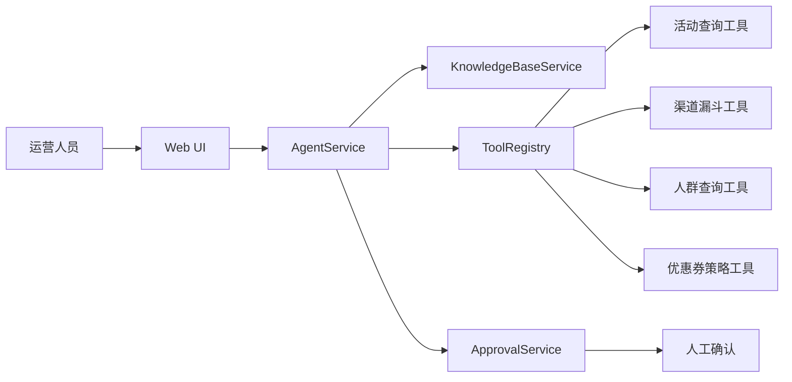

# 架构说明

## 模块说明

- `api`：REST API，包括聊天、审批、知识库搜索、MCP 风格工具列表。
- `agent`：Agent 编排层，负责计划、检索、工具调用和回答生成。
- `rag`：知识库检索层，当前是内存关键词检索，后续可替换成向量库。
- `tool`：工具注册表，模拟 MCP Tools 的 schema 和调用。
- `data`：模拟营销业务系统，后续可替换成真实微服务。
- `approval`：高风险动作审批层，避免 Agent 直接执行写操作。

## 为什么这样设计

这个 Demo 刻意不把所有逻辑写进 Controller。真实 Agent 应用的关键是把模型能力和业务系统边界分清：

- LLM 负责理解、规划和表达。
- RAG 负责提供可信上下文。
- Tool 负责访问真实系统。
- Approval 负责控制高风险动作。
- Trace 负责可观测和复盘。
